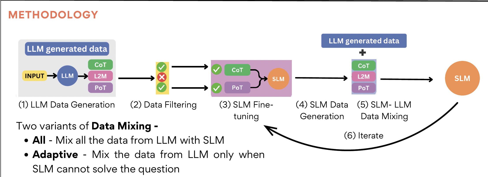

# SIKeD: Self-guided Iterative Knowledge Distillation for Mathematical Reasoning

This repository contains the implementation for the paper **"SIKeD: Self-guided Iterative Knowledge Distillation for Mathematical Reasoning"**, published at Findings of ACL 2025.

📄 **Paper**: [ACL Anthology](https://aclanthology.org/2025.findings-acl.513/)  
📊 **Authors**: Shivam Adarsh, Kumar Shridhar, Caglar Gulcehre, Nicholas Monath, Mrinmaya Sachan

## Abstract

Large Language Models (LLMs) can transfer their reasoning skills to smaller models by teaching them to generate the intermediate reasoning process required to solve multistep reasoning tasks. While LLMs can accurately solve reasoning tasks through a variety of strategies, even without fine-tuning, smaller models are not expressive enough to fit the LLMs distribution on all strategies when distilled and tend to prioritize one strategy over the others. This reliance on one strategy poses a challenge for smaller models when attempting to solve reasoning tasks that may be difficult with their preferred strategy.

To address this, we propose a distillation method **SIKeD**: **S**elf-guided **I**terative **K**nowledge **D**istillation, where the LLM teaches the smaller model to approach a task using different strategies and the smaller model uses its self-generated on-policy outputs to choose the most suitable strategy for the given task. The training continues in a self-guided iterative manner, where for each training iteration, a decision is made on how to combine the LLM data with the self-generated outputs. Unlike traditional distillation methods, SIKeD allows the smaller model to learn which strategy is suitable for a given task while continuously learning to solve a task using different strategies. Our experiments on various mathematical reasoning datasets show that SIKeD significantly outperforms traditional distillation techniques across smaller models of different sizes.

## Methodology

SIKeD uses an iterative distillation approach with data mixing to improve a Small Language Model's (SLM's) performance. The steps are shown below.



### Methodology Overview

#### Step 1: LLM Data Generation
- Input questions are fed into the LLM via different prompting strategies: 
  - Chain of Thought (CoT)
  - Program of Thought (PoT)
  - Least to Most (L2M)

#### Step 2: Data Filtering
- Only correct solutions are kept for distillation.

#### Step 3: SLM Fine-tuning
- The SLM is fine-tuned on filtered LLM data.

#### Step 4: SLM Data Generation
- After fine-tuning, the SLM produces its own outputs.

#### Step 5: SLM-LLM Data Mixing
- Mix SLM data with LLM data before the next iteration.
- Two variants:
  - All: merge all SLM + LLM data.
  - Adaptive: add LLM data only for SLM errors.

#### Step 6: Iterate
- Repeat steps 3–5 to improve the SLM.

## Repository Structure

```
SIKeD/
├── dataset_creation/          # Data generation and processing
│   ├── create_data.py         # Create datasets from LLM annotations
│   ├── math_solver.py         # PoT solver
│   ├── PROMPTS/               # Prompt templates (CoT, L2M, PoT)
│   └── iterative_data_creation/  # Iterative data generation scripts
├── fine-tuning/               # LoRA fine-tuning
│   ├── lora_train_and_save.py # Main training script
│   └── iter1_configs/         # Training configs
├── inference/                 # Model evaluation
│   ├── inference_all_checkpoints.py  # Run inference on all checkpoints
│   ├── inference_all_chk_all_data.py # Evaluate on all datasets
│   └── results.py             # Compute accuracies
└── requirements.txt           # Python dependencies
```

## Installation

1. Clone:
   ```bash
   git clone https://github.com/yourusername/SIKeD.git
   cd SIKeD
   ```

2. Install dependencies:
   ```bash
   pip install -r requirements.txt
   ```

   Note: For CUDA 11.8, you may need to install PyTorch first:
   ```bash
   pip install torch --index-url https://download.pytorch.org/whl/cu118
   pip install -r requirements.txt
   ```

## Requirements

Dependencies are listed in `requirements.txt`.

Key constraints:
- vllm == 0.4.1
- xformers < 0.0.26
- transformers == 4.40.2

See `requirements.txt` for the full list.

## Citation

```bibtex
@inproceedings{adarsh-etal-2025-siked,
    title = "{SIK}e{D}: Self-guided Iterative Knowledge Distillation for Mathematical Reasoning",
    author = "Adarsh, Shivam  and
      Shridhar, Kumar  and
      Gulcehre, Caglar  and
      Monath, Nicholas  and
      Sachan, Mrinmaya",
    booktitle = "Findings of the Association for Computational Linguistics: ACL 2025",
    month = jul,
    year = "2025",
    address = "Vienna, Austria",
    publisher = "Association for Computational Linguistics",
    url = "https://aclanthology.org/2025.findings-acl.513/",
    doi = "10.18653/v1/2025.findings-acl.513",
    pages = "9868--9880",
}
```

## License

Our work is licensed under a [Creative Commons Attribution 4.0 International License.](https://creativecommons.org/licenses/by/4.0/)
